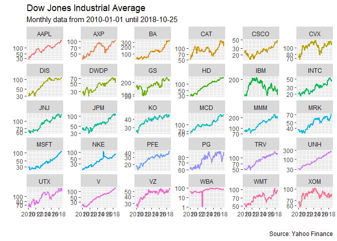

<!-- README.md is generated from README.Rmd. Please edit that file -->
YahooTickers
============

[](https://travis-ci.org/Reckziegel/YahooTickers)

The goal of YahooTickers is to help users to easily get stock index constituents from [Yahoo Finance](https://finance.yahoo.com/) without having to run complicated `for` loops. This may be specially useful for users that need to repeatably test investment strategies in different markets, but also be convenient if data is needed for it's side effects (plotting).

Instalation
-----------

You can install FromQuandl from github with:

``` r

# install.packages("devtools")
devtools::install_github("Reckziegel/FromQuandl")
```

Example
-------

Suppose we want to download all the stock constituents of the Dow Jones Industrial Average Index. This can easily be done with `get_tickers()` and `get_stock()` in one pipeline.

``` r
library(YahooTickers)
library(dplyr)

get_tickers("dow") %>% 
  get_stocks(., periodicity = "monthly")
#> # A tibble: 3,180 x 8
#>    index      tickers  open  high   low close    volume adjusted
#>    <date>     <chr>   <dbl> <dbl> <dbl> <dbl>     <dbl>    <dbl>
#>  1 2010-01-01 MMM      83.1  85.2  79.1  80.5  75208100     64.7
#>  2 2010-02-01 MMM      80.8  81.8  77.2  80.2  75020400     64.4
#>  3 2010-03-01 MMM      80.6  84.5  80.3  83.6  91066100     67.6
#>  4 2010-04-01 MMM      83.9  90.2  82.7  88.7  96407000     71.7
#>  5 2010-05-01 MMM      89.2  90.5  69.0  79.3 109573600     64.1
#>  6 2010-06-01 MMM      78.7  83    72.7  79.0 114407500     64.3
#>  7 2010-07-01 MMM      79.1  87.5  77.0  85.5  89556700     69.6
#>  8 2010-08-01 MMM      86.8  88.4  78.4  78.6  74721100     63.9
#>  9 2010-09-01 MMM      79.5  88    79.3  86.7  64059700     71.0
#> 10 2010-10-01 MMM      87.4  91.5  83.8  84.2  82038100     69.0
#> # ... with 3,170 more rows
```

Since the data is "tidy" it's ready to be used in conjunction with `ggplot2` and the `dplyr` verbs for further manipulation (if needed).

``` r
library(YahooTickers)
library(dplyr)
library(ggplot2)

get_tickers("dow") %>% 
  get_stocks(., periodicity = "monthly") %>% 
  ggplot(aes(x = index, y = close, color = tickers)) + 
  geom_line(show.legend = FALSE, size = 1) + 
  scale_y_log10() + 
  facet_wrap(~ tickers, scales = "free_y") + 
  labs(title    = "Dow Jones Industrial Average",
       subtitle = "Monthly data from 2010-01-01 until 2018-10-25",
       caption  = "Source: Yahoo Finance",
       x        = "", 
       y        = "") 
```



Currently, `YahooTickers` supports the following stock indexes:

-   `dow`: Dow Jones Industrial Average (United States)
-   `sp500`: S&P 500 (United States)
-   `nasdaq`: NASDAQ Composite Index (United States)
-   `nyse`: NYSE Composite Index (United States)
-   `amex`: AMEX Composite Index (United States)
-   `russell2000`: Russell 2000 Index (United States)
-   `ftse100`: FTSE 100 Index (United Kingdom)
-   `dax`: Deutsche Boerse AG German Stock (Germany)
-   `cac40`: CAC 40 Index (France)
-   `bel20`: BEL 20 Index (Belgium)
-   `topix`: TOPIX Core 30 Index (Japan)
-   `hangseng`: HangSeng Composite Index (Hong Kong)
-   `sensex`: S&P BSE SENSEX Index (India)
-   `jakarta`: Jakarta Stock Exchange Stock Index (Indonesia)
-   `bursa`: Bursa Malaysia Bhd (Malaysia)
-   `nzx50`: S&P/NZX 50 Gross Index (New Zealand)
-   `kospi`: Korea Stock Exchange KOSPI Index (south Korea)
-   `taiex`: Taiwan Stock Exchange Weighted Index (Taiwan)
-   `tsx`: S&P/TSX Composite Index (Canada)
-   `ibovespa`: Ibovespa Brasil Sao Paulo Stock Exchange Index (Brazil)
-   `ipc`: S&P/BMV IPC (Mexico)
-   `ipsa`: S&P/CLX IPSA (Chile)
-   `merval`: Buenos Aires Stock Exchange Merval Index (Argentina)

A Warning
---------

The [Yahoo Finance](https://finance.yahoo.com/) API works reasonably well, but there are cases in which does not cover or provide historical data for all stocks in an index universe. The `bel20` it's a good example: despite officially having 20 components, Yahoo Finance only maintain data for only 4. The message is clear: *always check the data after downloading!*
